# Diagrammes UML

Livrable « Diagrammes UML » du cahier des charges, à jour de la v1.1 (aperçu visiteur RF-12, connexion Google RF-13).

Trois formats pour chaque diagramme :

- **Images PNG** ([`docs/uml/images/`](uml/images/)) : à insérer dans le mémoire (résolution × 2). Les SVG sont à côté, pour un rendu vectoriel.
- **Mermaid** (sous chaque image) : version texte affichée par GitHub, pratique pour relire et modifier.
- **PlantUML** ([`docs/uml/`](uml/)) : sources en notation UML complète, si vous préférez les retravailler avec PlantUML.

| N° | Diagramme | Image | Source PlantUML |
|---|---|---|---|
| 1 | Cas d'utilisation | [PNG](uml/images/01-cas-utilisation.png) | [`01-cas-utilisation.puml`](uml/01-cas-utilisation.puml) |
| 2 | Classes | [PNG](uml/images/02-classes.png) | [`02-classes.puml`](uml/02-classes.puml) |
| 3 | Séquence « Obtenir des recommandations » | [PNG](uml/images/03-sequence-recommandations.png) | [`03-sequence-recommandations.puml`](uml/03-sequence-recommandations.puml) |
| 4 | Séquence « Connexion avec Google » | [PNG](uml/images/04-sequence-google.png) | [`04-sequence-google.puml`](uml/04-sequence-google.puml) |
| 5 | Séquence « Essayer sans compte » | [PNG](uml/images/05-sequence-apercu.png) | [`05-sequence-apercu.puml`](uml/05-sequence-apercu.puml) |
| 6 | Activité : parcours d'un apprenant | [PNG](uml/images/06-activite-parcours.png) | [`06-activite-parcours.puml`](uml/06-activite-parcours.puml) |
| 7 | États d'une recommandation | [PNG](uml/images/07-etats-recommandation.png) | [`07-etats-recommandation.puml`](uml/07-etats-recommandation.puml) |
| 8 | Déploiement | [PNG](uml/images/08-deploiement.png) | [`08-deploiement.puml`](uml/08-deploiement.puml) |

**Régénérer les images** après un changement du modèle : modifier `docs/uml/outils/sequences.py` ou `statiques.py`, puis

```bash
cd docs/uml/outils
python3 sequences.py ../images && python3 statiques.py ../images
CHROME=/chemin/vers/chrome ./render.sh "$PWD"/../images/*.svg   # SVG → PNG (× 2)
```

## 1. Cas d'utilisation

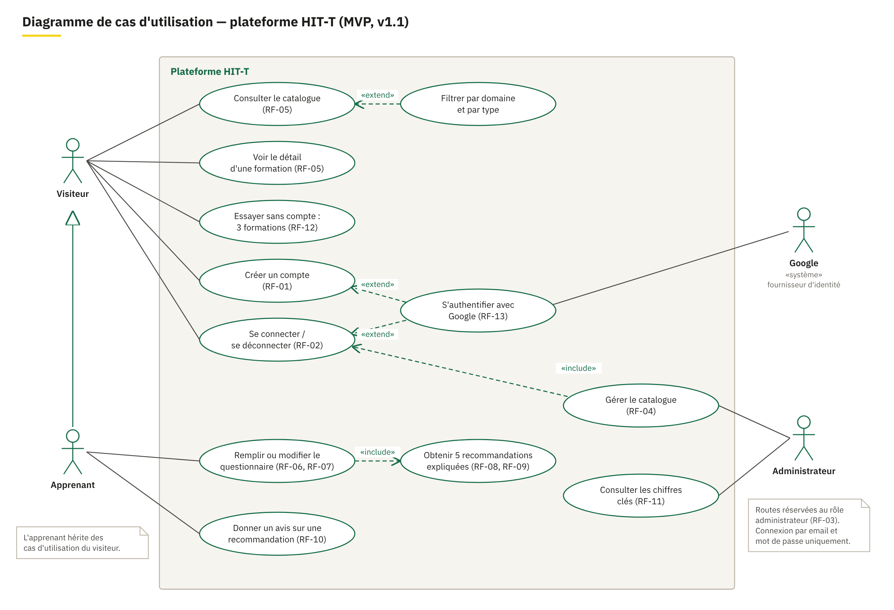

<details><summary>Version Mermaid</summary>

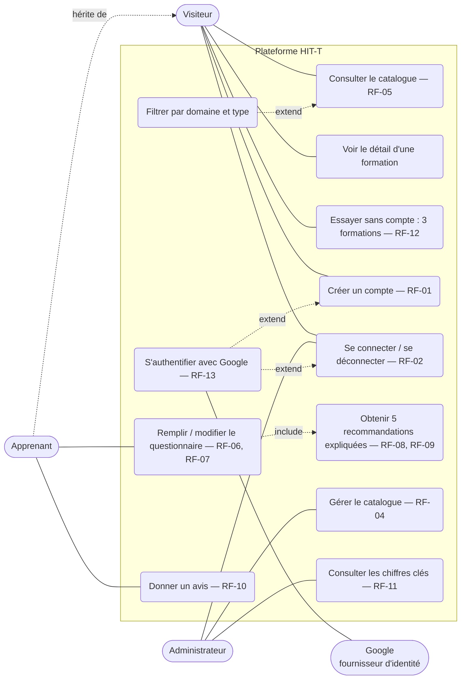
```mermaid
flowchart LR
    V([Visiteur])
    A([Apprenant])
    AD([Administrateur])
    G([Google<br/>fournisseur d'identité])

    subgraph Plateforme HIT-T
        UC1(Consulter le catalogue — RF-05)
        UC2(Filtrer par domaine et type)
        UC3(Voir le détail d'une formation)
        UC4(Essayer sans compte : 3 formations — RF-12)
        UC5(Créer un compte — RF-01)
        UC6(S'authentifier avec Google — RF-13)
        UC7(Se connecter / se déconnecter — RF-02)
        UC8(Remplir / modifier le questionnaire — RF-06, RF-07)
        UC9(Obtenir 5 recommandations expliquées — RF-08, RF-09)
        UC10(Donner un avis — RF-10)
        UC11(Gérer le catalogue — RF-04)
        UC12(Consulter les chiffres clés — RF-11)
    end

    V --- UC1 & UC3 & UC4 & UC5 & UC7
    A --- UC8 & UC10
    AD --- UC7 & UC11 & UC12
    A -. hérite de .-> V
    UC2 -. extend .-> UC1
    UC6 -. extend .-> UC5
    UC6 -. extend .-> UC7
    UC8 -. include .-> UC9
    UC6 --- G
```

</details>

L'apprenant hérite des cas du visiteur. Les routes administrateur sont protégées (RF-03) ; l'administrateur se connecte uniquement par email et mot de passe. Le rôle Conseiller pédagogique est reporté en V2.

## 2. Classes

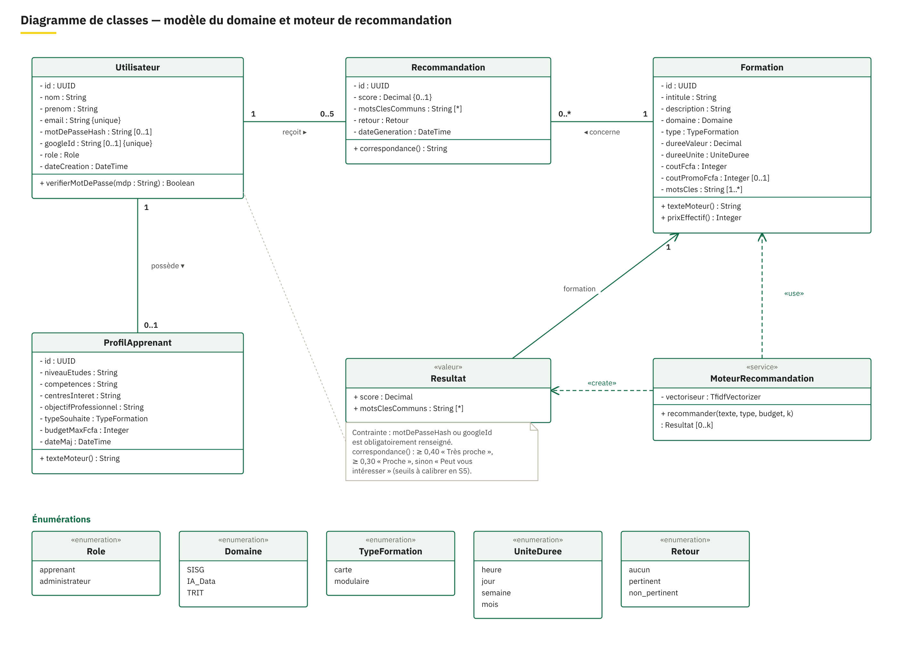

<details><summary>Version Mermaid</summary>

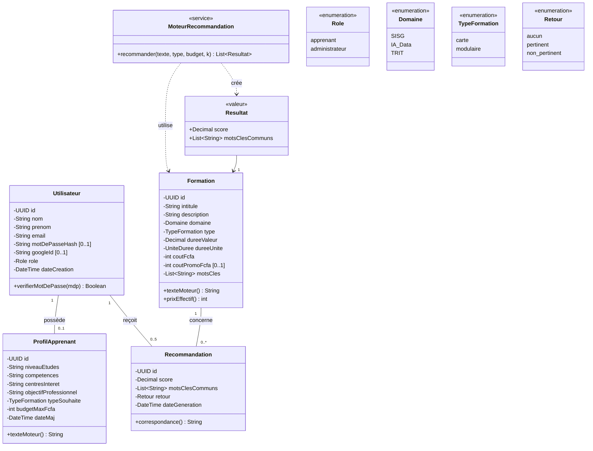
```mermaid
classDiagram
    class Utilisateur {
        -UUID id
        -String nom
        -String prenom
        -String email
        -String motDePasseHash [0..1]
        -String googleId [0..1]
        -Role role
        -DateTime dateCreation
        +verifierMotDePasse(mdp) Boolean
    }
    class ProfilApprenant {
        -UUID id
        -String niveauEtudes
        -String competences
        -String centresInteret
        -String objectifProfessionnel
        -TypeFormation typeSouhaite
        -int budgetMaxFcfa
        -DateTime dateMaj
        +texteMoteur() String
    }
    class Formation {
        -UUID id
        -String intitule
        -String description
        -Domaine domaine
        -TypeFormation type
        -Decimal dureeValeur
        -UniteDuree dureeUnite
        -int coutFcfa
        -int coutPromoFcfa [0..1]
        -List~String~ motsCles
        +texteMoteur() String
        +prixEffectif() int
    }
    class Recommandation {
        -UUID id
        -Decimal score
        -List~String~ motsClesCommuns
        -Retour retour
        -DateTime dateGeneration
        +correspondance() String
    }
    class MoteurRecommandation {
        <<service>>
        +recommander(texte, type, budget, k) List~Resultat~
    }
    class Resultat {
        <<valeur>>
        +Decimal score
        +List~String~ motsClesCommuns
    }
    class Role {
        <<enumeration>>
        apprenant
        administrateur
    }
    class Domaine {
        <<enumeration>>
        SISG
        IA_Data
        TRIT
    }
    class TypeFormation {
        <<enumeration>>
        carte
        modulaire
    }
    class Retour {
        <<enumeration>>
        aucun
        pertinent
        non_pertinent
    }

    Utilisateur "1" -- "0..1" ProfilApprenant : possède
    Utilisateur "1" -- "0..5" Recommandation : reçoit
    Formation "1" -- "0..*" Recommandation : concerne
    MoteurRecommandation ..> Formation : utilise
    MoteurRecommandation ..> Resultat : crée
    Resultat --> "1" Formation
```

</details>

Règle : `motDePasseHash` ou `googleId` est obligatoirement renseigné (contrainte `CHECK` en base). `correspondance()` traduit le score : ≥ 0,40 « Très proche », ≥ 0,30 « Proche », sinon « Peut vous intéresser » (seuils à calibrer en S5).

## 3. Séquence « Obtenir des recommandations »

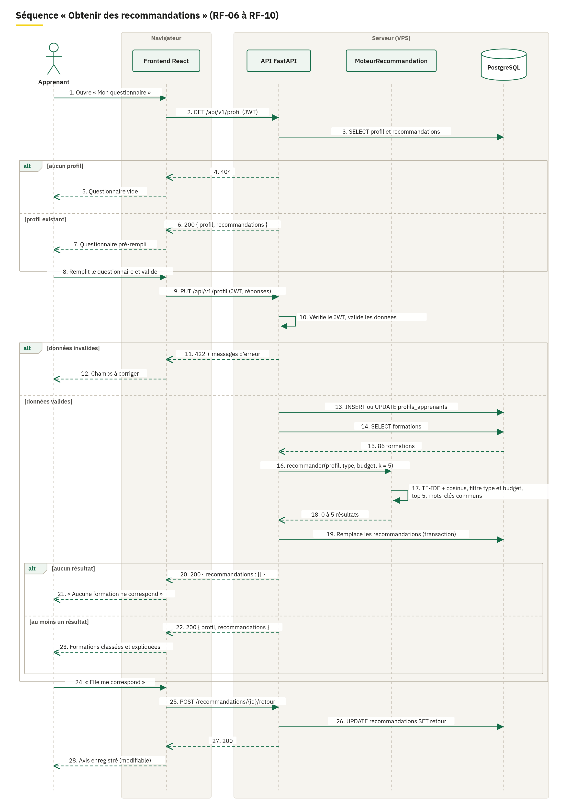

<details><summary>Version Mermaid</summary>

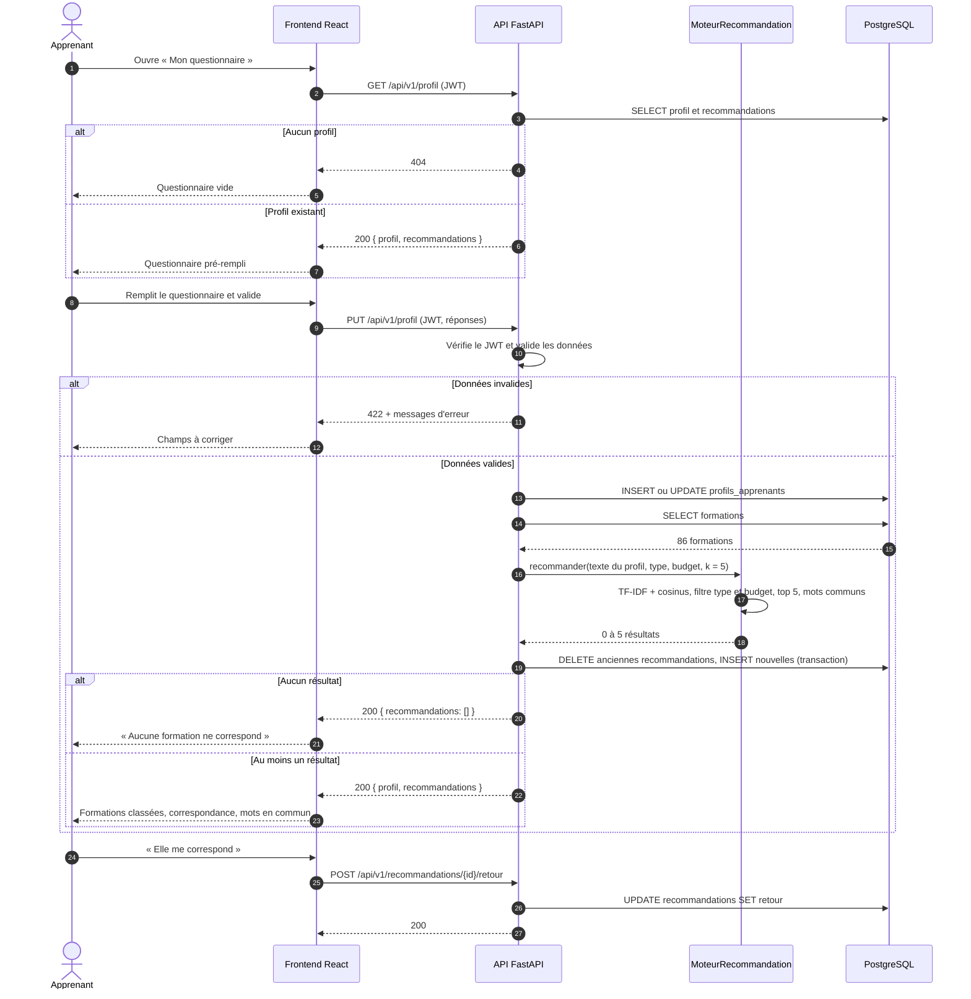
```mermaid
sequenceDiagram
    autonumber
    actor A as Apprenant
    participant UI as Frontend React
    participant API as API FastAPI
    participant M as MoteurRecommandation
    participant DB as PostgreSQL

    A->>UI: Ouvre « Mon questionnaire »
    UI->>API: GET /api/v1/profil (JWT)
    API->>DB: SELECT profil et recommandations
    alt Aucun profil
        API-->>UI: 404
        UI-->>A: Questionnaire vide
    else Profil existant
        API-->>UI: 200 { profil, recommandations }
        UI-->>A: Questionnaire pré-rempli
    end
    A->>UI: Remplit le questionnaire et valide
    UI->>API: PUT /api/v1/profil (JWT, réponses)
    API->>API: Vérifie le JWT et valide les données
    alt Données invalides
        API-->>UI: 422 + messages d'erreur
        UI-->>A: Champs à corriger
    else Données valides
        API->>DB: INSERT ou UPDATE profils_apprenants
        API->>DB: SELECT formations
        DB-->>API: 86 formations
        API->>M: recommander(texte du profil, type, budget, k = 5)
        M->>M: TF-IDF + cosinus, filtre type et budget, top 5, mots communs
        M-->>API: 0 à 5 résultats
        API->>DB: DELETE anciennes recommandations, INSERT nouvelles (transaction)
        alt Aucun résultat
            API-->>UI: 200 { recommandations: [] }
            UI-->>A: « Aucune formation ne correspond »
        else Au moins un résultat
            API-->>UI: 200 { profil, recommandations }
            UI-->>A: Formations classées, correspondance, mots en commun
        end
    end
    A->>UI: « Elle me correspond »
    UI->>API: POST /api/v1/recommandations/{id}/retour
    API->>DB: UPDATE recommandations SET retour
    API-->>UI: 200
```

</details>

## 4. Séquence « Connexion avec Google »

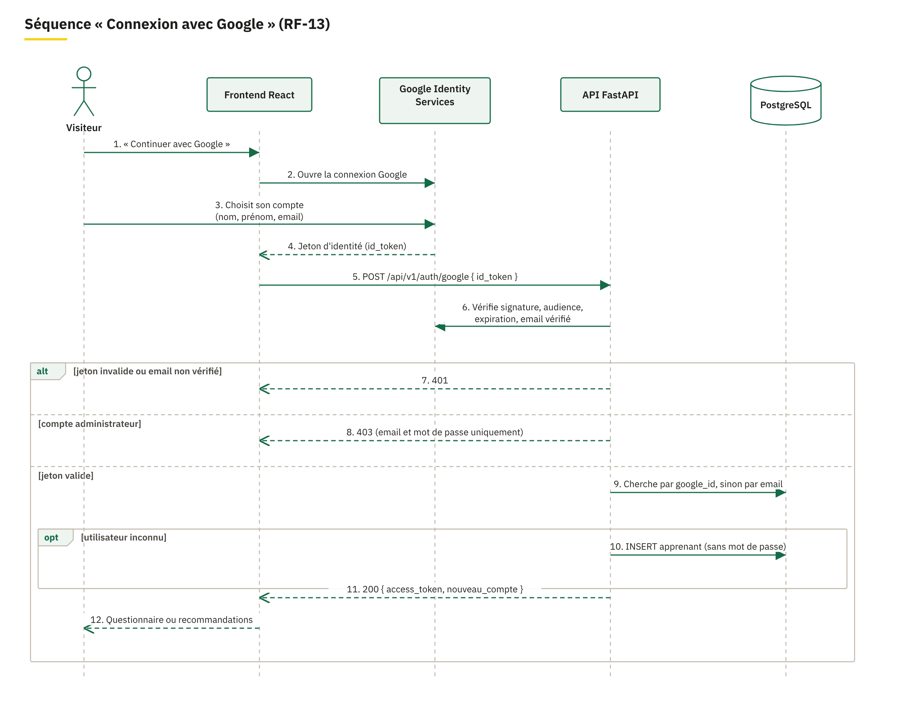

<details><summary>Version Mermaid</summary>

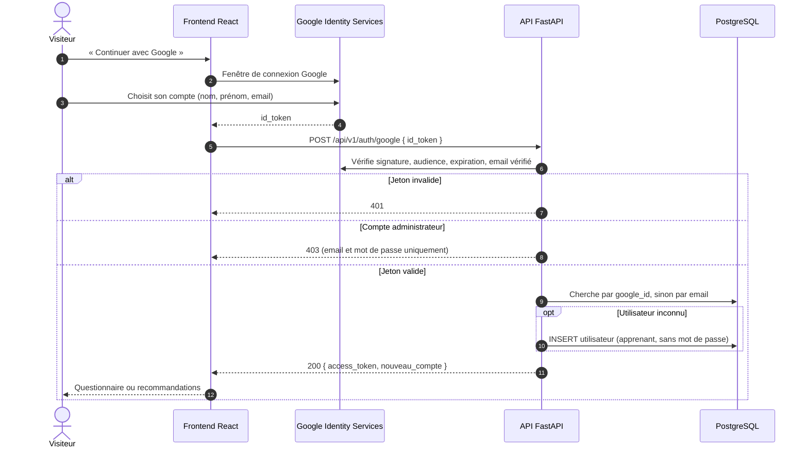
```mermaid
sequenceDiagram
    autonumber
    actor V as Visiteur
    participant UI as Frontend React
    participant G as Google Identity Services
    participant API as API FastAPI
    participant DB as PostgreSQL

    V->>UI: « Continuer avec Google »
    UI->>G: Fenêtre de connexion Google
    V->>G: Choisit son compte (nom, prénom, email)
    G-->>UI: id_token
    UI->>API: POST /api/v1/auth/google { id_token }
    API->>G: Vérifie signature, audience, expiration, email vérifié
    alt Jeton invalide
        API-->>UI: 401
    else Compte administrateur
        API-->>UI: 403 (email et mot de passe uniquement)
    else Jeton valide
        API->>DB: Cherche par google_id, sinon par email
        opt Utilisateur inconnu
            API->>DB: INSERT utilisateur (apprenant, sans mot de passe)
        end
        API-->>UI: 200 { access_token, nouveau_compte }
        UI-->>V: Questionnaire ou recommandations
    end
```

</details>

## 5. Séquence « Essayer sans compte »

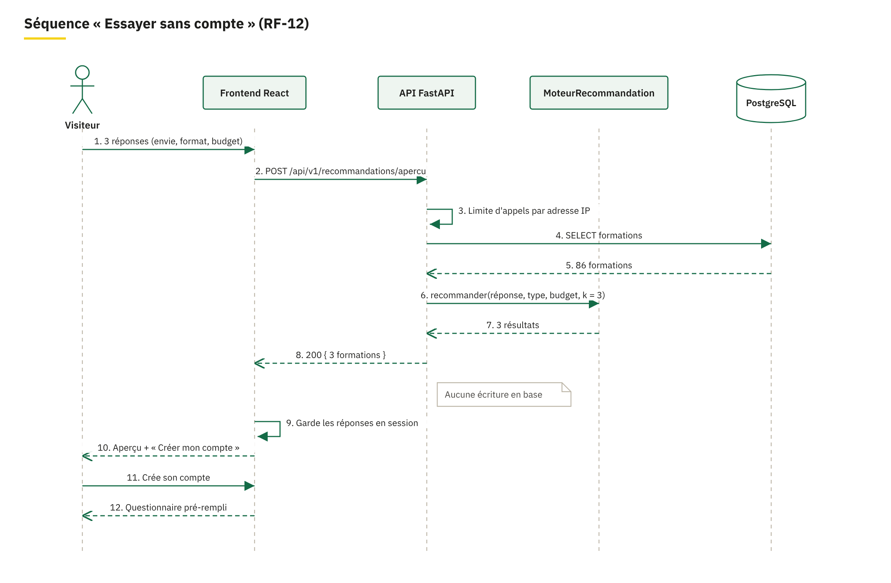

<details><summary>Version Mermaid</summary>

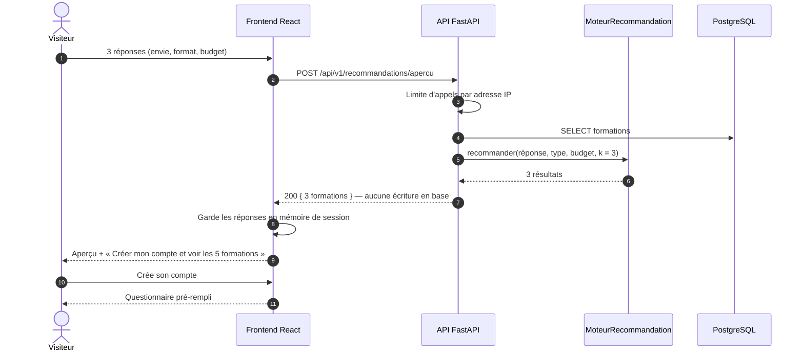
```mermaid
sequenceDiagram
    autonumber
    actor V as Visiteur
    participant UI as Frontend React
    participant API as API FastAPI
    participant M as MoteurRecommandation
    participant DB as PostgreSQL

    V->>UI: 3 réponses (envie, format, budget)
    UI->>API: POST /api/v1/recommandations/apercu
    API->>API: Limite d'appels par adresse IP
    API->>DB: SELECT formations
    API->>M: recommander(réponse, type, budget, k = 3)
    M-->>API: 3 résultats
    API-->>UI: 200 { 3 formations } — aucune écriture en base
    UI->>UI: Garde les réponses en mémoire de session
    UI-->>V: Aperçu + « Créer mon compte et voir les 5 formations »
    V->>UI: Crée son compte
    UI-->>V: Questionnaire pré-rempli
```

</details>

## 6. Activité : parcours d'un apprenant

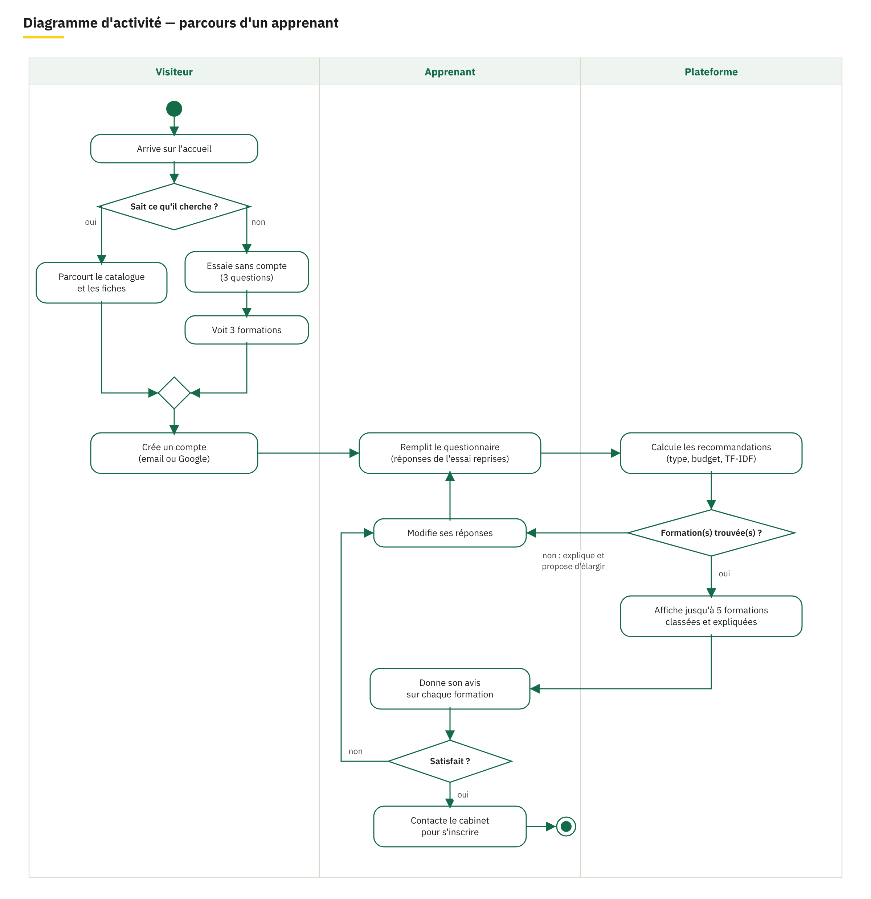

<details><summary>Version Mermaid</summary>

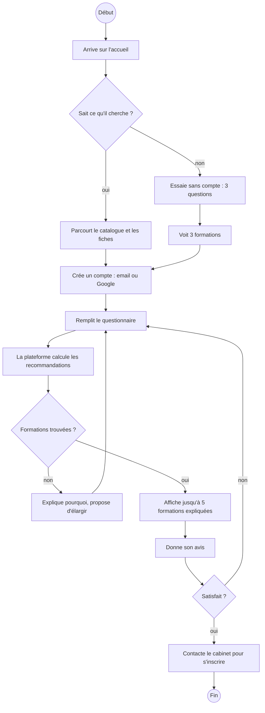
```mermaid
flowchart TD
    S((Début)) --> A1[Arrive sur l'accueil]
    A1 --> D1{Sait ce qu'il cherche ?}
    D1 -- oui --> A2[Parcourt le catalogue et les fiches]
    D1 -- non --> A3[Essaie sans compte : 3 questions] --> A4[Voit 3 formations]
    A2 --> A5[Crée un compte : email ou Google]
    A4 --> A5
    A5 --> A6[Remplit le questionnaire]
    A6 --> A7[La plateforme calcule les recommandations]
    A7 --> D2{Formations trouvées ?}
    D2 -- non --> A8[Explique pourquoi, propose d'élargir] --> A6
    D2 -- oui --> A9[Affiche jusqu'à 5 formations expliquées]
    A9 --> A10[Donne son avis]
    A10 --> D3{Satisfait ?}
    D3 -- non --> A6
    D3 -- oui --> A11[Contacte le cabinet pour s'inscrire] --> F((Fin))
```

</details>

## 7. États d'une recommandation

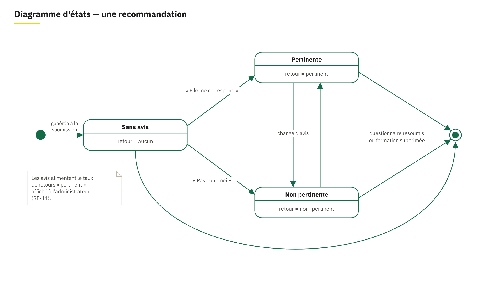

<details><summary>Version Mermaid</summary>

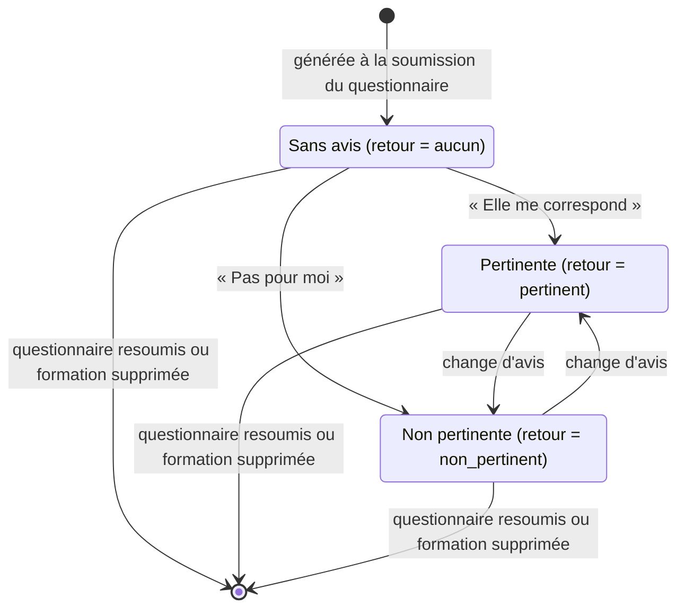
```mermaid
stateDiagram-v2
    [*] --> SansAvis : générée à la soumission du questionnaire
    SansAvis : Sans avis (retour = aucun)
    Pertinente : Pertinente (retour = pertinent)
    NonPertinente : Non pertinente (retour = non_pertinent)
    SansAvis --> Pertinente : « Elle me correspond »
    SansAvis --> NonPertinente : « Pas pour moi »
    Pertinente --> NonPertinente : change d'avis
    NonPertinente --> Pertinente : change d'avis
    SansAvis --> [*] : questionnaire resoumis ou formation supprimée
    Pertinente --> [*] : questionnaire resoumis ou formation supprimée
    NonPertinente --> [*] : questionnaire resoumis ou formation supprimée
```

</details>

## 8. Déploiement

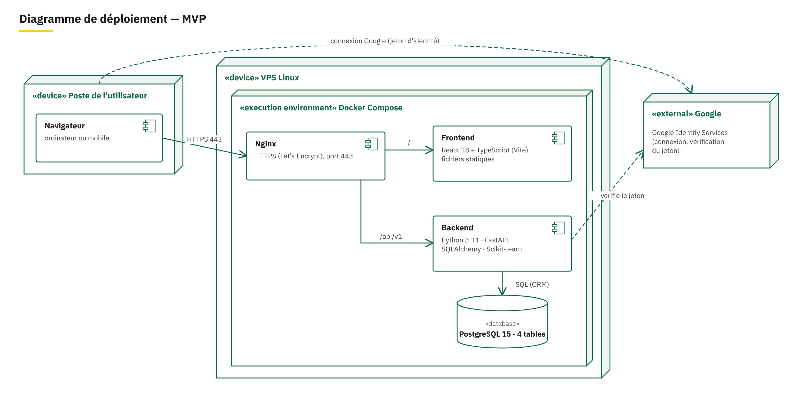

<details><summary>Version Mermaid</summary>

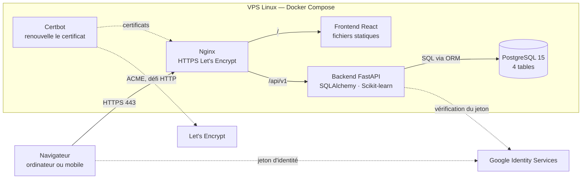
```mermaid
flowchart LR
    NAV[Navigateur<br/>ordinateur ou mobile] -- HTTPS 443 --> NGX
    subgraph VPS[VPS Linux — Docker Compose]
        NGX[Nginx<br/>HTTPS Let's Encrypt] -- / --> FE[Frontend React<br/>fichiers statiques]
        NGX -- /api/v1 --> BE[Backend FastAPI<br/>SQLAlchemy · Scikit-learn]
        BE -- SQL via ORM --> PG[(PostgreSQL 15<br/>4 tables)]
        CB[Certbot<br/>renouvelle le certificat] -. certificats .-> NGX
    end
    CB -. ACME, défi HTTP .-> LE[Let's Encrypt]
    NAV -. jeton d'identité .-> GOO[Google Identity Services]
    BE -. vérification du jeton .-> GOO
```

</details>
